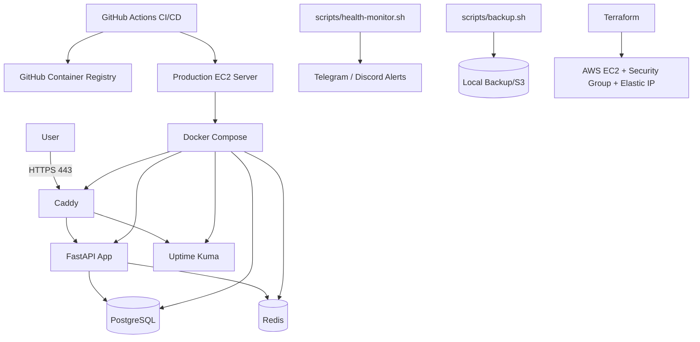

# StatusPulse

Production-ready containerized monitoring platform with:

* FastAPI application
* PostgreSQL
* Redis
* Uptime Kuma
* Caddy reverse proxy
* Docker Compose orchestration
* GitHub Actions CI/CD
* Terraform Infrastructure as Code
* Health monitoring + alerting
* Automated backups
* Security hardening

---

# Architecture Diagram



---

# Repository Structure

```text
statuspulse/
├── .github/workflows/
│   ├── ci.yml
│   └── deploy.yml
├── app/
├── caddy/
├── scripts/
├── terraform/
├── tests/
├── docker-compose.yml
├── Dockerfile
├── README.md
└── SECURITY.md
```

---

# Features

* Dockerized microservice stack
* Reverse proxy with HTTPS
* Security headers + CSP
* Rate limiting
* Automated CI/CD
* Health monitoring
* Telegram/Discord alerts
* PostgreSQL backup & restore
* Terraform provisioning
* Tailscale remote access
* Automatic rollback deployment

---

# Prerequisites

## Local Development

Install:

* Docker
* Docker Compose
* Git
* Make

### Ubuntu

```bash
sudo apt update

sudo apt install -y \
    docker.io \
    docker-compose \
    git \
    curl \
    make
```

Enable Docker:

```bash
sudo systemctl enable docker
sudo systemctl start docker
```

Add your user to docker group:

```bash
sudo usermod -aG docker $USER
newgrp docker
```

---

# Environment Variables

Create `.env`:

```bash
cp .env.example .env
```

Update values:

```env
DB_NAME=statuspulse
DB_USER=statuspulse
DB_PASSWORD=strongpassword

REDIS_PASSWORD=strongredispassword

APP_PORT=8000
```

---

# Run Locally with Docker Compose

## Start Stack

```bash
docker compose up -d
```

## Check Running Containers

```bash
docker ps
```

## View Logs

```bash
docker compose logs -f
```

## Stop Stack

```bash
docker compose down
```

---

# Application URLs

## Main API

```text
https://<domain>/
```

## Swagger Docs

```text
https://<domain>/docs
```

## Health Endpoint

```text
https://<domain>/health
```

## Uptime Kuma

```text
https://<domain>:8443
```

---

# Production Deployment

Production deployment is automated using GitHub Actions.

## Deployment Flow

```text
Git Push
   ↓
CI Pipeline
   ↓
Build Docker Image
   ↓
Push to GHCR
   ↓
SSH into EC2
   ↓
Pull Latest Image
   ↓
Docker Compose Deploy
   ↓
Health Check
   ↓
Rollback if Failed
```

---

# Infrastructure as Code (Terraform)

Terraform provisions:

* AWS EC2 instance
* Security Group
* Elastic IP
* SSH Key Pair

## Terraform Structure

```text
terraform/
├── main.tf
├── variables.tf
├── outputs.tf
├── userdata.sh
└── terraform.tfvars
```

---

# Deploy Infrastructure

## Initialize Terraform

```bash
cd terraform

terraform init
```

## Preview Changes

```bash
terraform plan
```

## Apply Infrastructure

```bash
terraform apply
```

## Destroy Infrastructure

```bash
terraform destroy
```

---

# Security Hardening

Implemented:

* Root login disabled
* Password authentication disabled
* Custom SSH port
* UFW firewall
* HTTPS enforced
* Security headers
* CSP policy
* Docker non-root deployment user
* Automatic security updates
* Swap memory configured

---

# Reverse Proxy Security

Implemented in Caddy:

* HSTS
* X-Frame-Options
* X-Content-Type-Options
* X-XSS-Protection
* Referrer-Policy
* Permissions-Policy
* Content-Security-Policy
* Request body limits
* Access logging
* Rate limiting

---

# CI/CD Pipeline

## CI Workflow (`ci.yml`)

Runs on:

* Push to `main`
* Pull requests to `main`

Pipeline steps:

* Checkout repository
* Setup Python
* Ruff linting
* Hadolint Docker scan
* Build Docker image
* Start Docker Compose stack
* Run integration tests
* Upload artifacts
* Tear down stack

---

## Deploy Workflow (`deploy.yml`)

Runs after CI succeeds on `main`.

Deployment steps:

* Build image
* Tag image with SHA + latest
* Push image to GHCR
* SSH into production server
* Pull latest image
* Restart containers
* Run health check
* Rollback if deployment fails
* Send notifications

---

# Monitoring & Alerting

## Uptime Kuma

Monitors:

* Main application
* Health endpoint
* Docker services

---

## Health Monitor Script

Location:

```text
scripts/health-monitor.sh
```

Runs every 5 minutes via cron.

Checks:

* `/health` endpoint
* Disk usage
* Memory usage
* Docker container status
* TLS certificate expiry

Logs:

```text
/var/log/statuspulse-monitor.log
```

---

# Alert Channels

Configured channels:

* Telegram
* Discord

Alert triggers:

* Container down
* Health endpoint failure
* High disk usage
* High memory usage
* TLS expiry warning

---

# Cron Jobs

## Health Monitor

```bash
*/5 * * * * /opt/statuspulse/scripts/health-monitor.sh
```

## Daily Backup

```bash
0 2 * * * /opt/statuspulse/scripts/backup.sh
```

---

# Backup & Restore

## Backup Script

Location:

```text
scripts/backup.sh
```

Creates:

```text
statuspulse_db_YYYY-MM-DD_HHMMSS.sql.gz
```

Features:

* PostgreSQL dump
* Compression
* Rotation (keep last 7 backups)
* Optional S3 upload
* Logging

---

# Manual Backup

```bash
bash scripts/backup.sh
```

---

# Restore Database

## Extract Backup

```bash
gunzip statuspulse_db_2026-05-09_120000.sql.gz
```

## Restore

```bash
docker exec -i statuspulse-postgres \
    psql -U statuspulse -d statuspulse \
    < statuspulse_db_2026-05-09_120000.sql
```

---

# Rate Limiting Test

```bash
for i in $(seq 1 120); do
  curl -s -o /dev/null -w "%{http_code}\n" \
  https://<domain>/health
done
```

Expected:

```text
200
200
429
429
```

---

# Container Security Scanning

Scanned using:

* Trivy
* Hadolint

Findings documented in:

```text
SECURITY.md
```

---

# Tailscale Access

Server connected through Tailscale.

Example:

```text
https://ip-172-31-45-227.taildb17d2.ts.net
```

---

# Useful Commands

## Restart Caddy

```bash
docker compose restart caddy
```

## Restart Entire Stack

```bash
docker compose restart
```

## View Container Logs

```bash
docker logs -f statuspulse-app
```

## Check Health

```bash
curl http://localhost:8000/health
```

---

# Troubleshooting

---

## Swagger UI Blank Page

Cause:

* CSP blocking JS/CSS

Fix:

Allow jsdelivr in CSP:

```caddy
script-src 'self' 'unsafe-inline' 'unsafe-eval' https://cdn.jsdelivr.net;
style-src 'self' 'unsafe-inline' https://cdn.jsdelivr.net;
```

Restart Caddy:

```bash
docker compose restart caddy
```

---

## Docker Image Pull Access Denied

Login to GHCR:

```bash
echo $GHCR_TOKEN | docker login ghcr.io -u USERNAME --password-stdin
```

---

## Uptime Kuma Assets Returning 404

Cause:

* Incorrect base path handling

Fix:

Use separate subdomain or port for Uptime Kuma.

---

## Health Monitor Not Sending Alerts

Check:

```bash
echo $ALERT_WEBHOOK_URL
```

Test webhook manually:

```bash
curl -X POST "$ALERT_WEBHOOK_URL"
```

---

## Terraform State Locked

Run:

```bash
terraform force-unlock LOCK_ID
```

---

# Security Notes

Do NOT commit:

* `.env`
* `terraform.tfvars`
* SSH private keys
* Tailscale auth keys
* GitHub PAT tokens

---

# Authors

Vipin Singh

---

# License

MIT License
